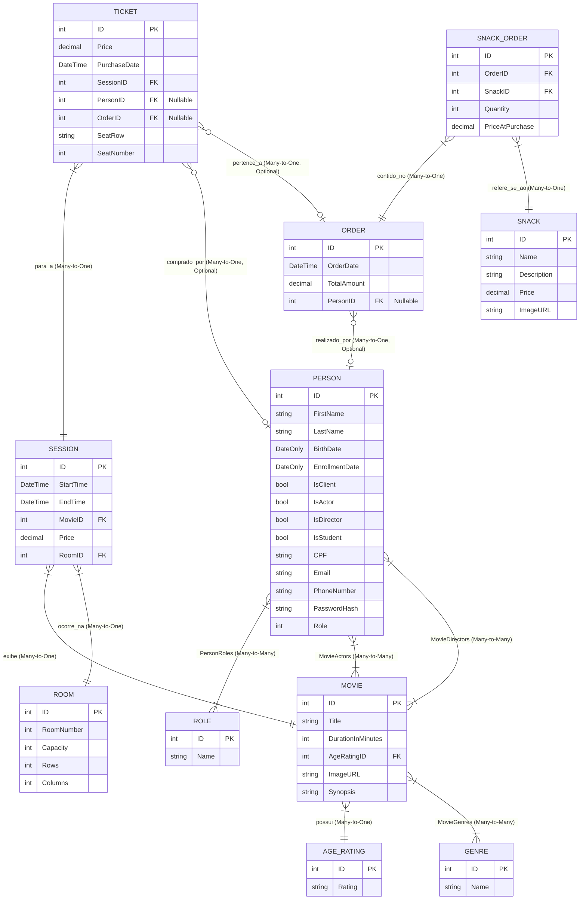

# Diagrama de Entidade e Relacionamento (DER) - CineMax

Este documento apresenta o modelo de dados do projeto **CineMax**, detalhando as entidades, seus atributos, chaves primárias/estrangeiras e os relacionamentos.

---

## 1. Diagrama em Mermaid

O diagrama abaixo utiliza a notação Mermaid. Ele é renderizado automaticamente em editores compatíveis com Markdown (como GitHub, Azure DevOps, VS Code, Notion, etc.).

---

## 2. Descrição das Entidades

### 2.1. Person (Pessoas)
Representa qualquer indivíduo registrado no sistema. Devido à modelagem unificada, uma pessoa pode desempenhar múltiplos papéis simultaneamente (Cliente, Ator, Diretor, etc.).
*   **Campos principais:**
    *   `ID` (Chave Primária): Identificador único da pessoa.
    *   `FirstName` e `LastName`: Nome e sobrenome.
    *   `CPF`, `Email`, `PhoneNumber`: Informações de contato e identificação (usados principalmente para clientes e administradores).
    *   `PasswordHash`: Senha criptografada para login dos usuários.
    *   `Role`: Nível de acesso no sistema (Cliente, Administrador, Funcionário).
    *   Flags booleanos (`IsClient`, `IsActor`, `IsDirector`, `IsStudent`): Determinam os papéis daquela pessoa no domínio.

### 2.2. Role (Perfil de Acesso)
Representa os perfis de acesso concedidos aos usuários (Pessoas) na segurança da aplicação.
*   **Campos principais:**
    *   `ID` (PK): Identificador do perfil.
    *   `Name`: Nome do perfil (ex: `Admin`, `Client`, `Employee`).

### 2.3. Movie (Filmes)
Armazena as informações catalogadas dos filmes em exibição ou futuros lançamentos.
*   **Campos principais:**
    *   `ID` (PK): Identificador único do filme.
    *   `Title`: Título do filme.
    *   `DurationInMinutes`: Tempo de duração em minutos.
    *   `AgeRatingID` (FK): Referência à classificação indicativa do filme.
    *   `ImageURL`: Link ou caminho local para o pôster oficial.
    *   `Synopsis`: Resumo do enredo do filme.

### 2.4. AgeRating (Classificação Indicativa)
Tabela de domínio com os limites de faixa etária recomendados para os filmes.
*   **Campos principais:**
    *   `ID` (PK): Identificador da classificação.
    *   `Rating`: Descrição da classificação (ex: `Livre`, `12`, `16`, `18`).

### 2.5. Genre (Gêneros)
Classificações temáticas dos filmes (Ação, Drama, Comédia, etc.).
*   **Campos principais:**
    *   `ID` (PK): Identificador do gênero.
    *   `Name`: Nome do gênero.

### 2.6. Room (Salas)
Representa as salas físicas do cinema onde as sessões ocorrem.
*   **Campos principais:**
    *   `ID` (PK): Identificador da sala.
    *   `RoomNumber`: Número físico da sala.
    *   `Capacity`: Capacidade máxima total de espectadores.
    *   `Rows` e `Columns`: Definição de layout (quantidade de fileiras e colunas de assentos para o mapa visual de compra).

### 2.7. Session (Sessões)
Uma exibição específica de um filme em uma determinada sala e horário.
*   **Campos principais:**
    *   `ID` (PK): Identificador da sessão.
    *   `StartTime` e `EndTime`: Horários de início e término da sessão.
    *   `MovieID` (FK): Referência ao filme exibido.
    *   `RoomID` (FK): Referência à sala da exibição.
    *   `Price`: Preço base do ingresso para aquela sessão específica.

### 2.8. Ticket (Ingressos)
Os bilhetes individuais comprados para uma sessão. Cada ingresso reserva um assento físico.
*   **Campos principais:**
    *   `ID` (PK): Identificador único do ingresso.
    *   `Price`: Valor cobrado pelo ingresso (pode sofrer descontos como meia-entrada).
    *   `PurchaseDate`: Data e hora da compra.
    *   `SessionID` (FK): Sessão à qual o ingresso dá direito.
    *   `PersonID` (FK, Opcional): Cliente que comprou o ingresso.
    *   `OrderID` (FK, Opcional): Pedido agrupador da compra.
    *   `SeatRow` e `SeatNumber`: Coordenadas do assento reservado (ex: fileira `C`, assento `5`).

### 2.9. Order (Pedidos)
O agrupador financeiro de uma compra efetuada pelo cliente. Pode conter vários ingressos e produtos da bomboniere de uma única vez.
*   **Campos principais:**
    *   `ID` (PK): Identificador do pedido.
    *   `OrderDate`: Data/Hora de fechamento da compra.
    *   `TotalAmount`: Valor total pago pelo pedido completo.
    *   `PersonID` (FK, Opcional): Cliente que realizou a compra.

### 2.10. Snack (Bombonière / Produtos)
Os alimentos e bebidas disponíveis para venda no snack bar do cinema (Pipocas, Refrigerantes, Doces, etc.).
*   **Campos principais:**
    *   `ID` (PK): Identificador do produto.
    *   `Name` e `Description`: Nome e detalhes do produto.
    *   `Price`: Preço de venda atual do produto.
    *   `ImageURL`: Imagem ilustrativa do produto.

### 2.11. SnackOrder (Itens do Pedido)
Tabela de associação/detalhe que registra quais lanches foram comprados em cada pedido.
*   **Campos principais:**
    *   `ID` (PK): Identificador do item.
    *   `OrderID` (FK): Pedido associado.
    *   `SnackID` (FK): Lanche associado.
    *   `Quantity`: Quantidade comprada do produto.
    *   `PriceAtPurchase`: Preço unitário no momento exato da compra (histórico financeiro).

---

## 3. Principais Relacionamentos do Sistema

1.  **Person <-> Role (Muitos para Muitos):** Um usuário pode ter vários papéis de segurança e um papel pode ser atribuído a múltiplos usuários.
2.  **Person <-> Movie (Muitos para Muitos):**
    *   *Elenco:* Atores (`Actors`) podem atuar em vários filmes, e um filme possui vários atores.
    *   *Direção:* Diretores (`Directors`) podem dirigir vários filmes, e um filme pode ter vários diretores.
3.  **Movie <-> Genre (Muitos para Muitos):** Um filme pode pertencer a múltiplos gêneros, e um gênero categoriza vários filmes.
4.  **Movie <-> AgeRating (Muitos para Um):** Cada classificação indicativa pode se aplicar a múltiplos filmes, mas cada filme possui apenas uma classificação indicativa obrigatória.
5.  **Session <-> Movie & Room (Muitos para Um):** Uma sessão exibe exatamente um filme e ocorre em exatamente uma sala.
6.  **Ticket <-> Session (Muitos para Um):** Cada ingresso pertence a uma única sessão específica, mas uma sessão pode vender múltiplos ingressos (até o limite da sala).
7.  **Order <-> Ticket & SnackOrder (Um para Muitos):** Um pedido agrupa a compra de um ou mais ingressos (`Tickets`) e um ou mais itens de bombonière (`SnackOrder`).
8.  **SnackOrder <-> Snack (Muitos para Um):** Um registro de venda de lanche referencia um único produto cadastrado, mas um lanche pode ser vendido em vários pedidos diferentes.
